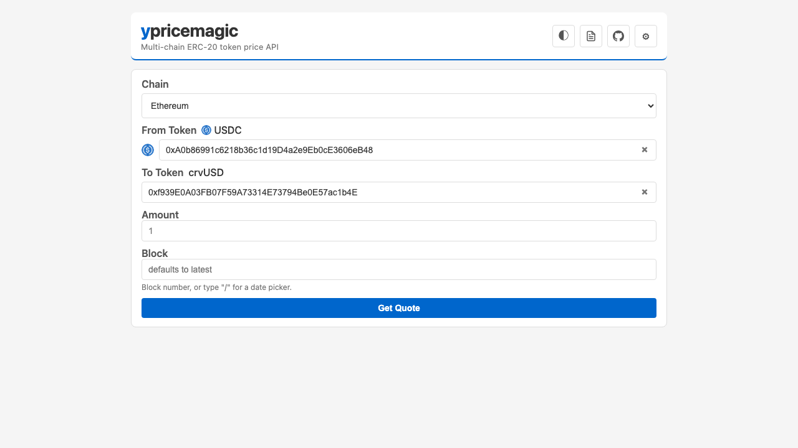

# ypricemagic-server

A multi-chain token price API backed by [ypricemagic](https://github.com/BobTheBuidler/ypricemagic). One container runs per chain; a shared Traefik proxy routes requests by host plus chain-prefixed paths.

## Architecture

```
client → traefik-proxy:8000 → frontend:8080
                            → ypm-ethereum:8001
                            → ypm-arbitrum:8001
                            → ypm-optimism:8001
                            → ypm-base:8001
```

Each chain container runs FastAPI + brownie + dank_mids + ypricemagic. Prices are cached to disk (diskcache) at `/data/cache`, keyed by `token:block`.

## Setup

Create two env files:

- app config: copy `env.example` to `.env`
- proxy config: copy `traefik-proxy/env.example` to `traefik-proxy/.env`

App `.env`:

```
RPC_URL_ETHEREUM=https://...
RPC_URL_ARBITRUM=https://...
RPC_URL_OPTIMISM=https://...
RPC_URL_BASE=https://...
ETHERSCAN_TOKEN=your_etherscan_api_key
VIRTUAL_HOST=localhost
```

Proxy `traefik-proxy/.env`:

```
PORT=8000
```

## Running

```bash
docker compose -f traefik-proxy/docker-compose.yml --env-file traefik-proxy/.env up -d
docker compose up --build
```

For local usage, open `http://localhost:<PORT>` from `traefik-proxy/.env`.

For a deployed host-based setup, set `VIRTUAL_HOST` in `.env` (for example `VIRTUAL_HOST=ypricemagic.stytt.com`) and access:

- `https://<VIRTUAL_HOST>/` — frontend UI
- `https://<VIRTUAL_HOST>/ethereum/docs` — Swagger for ethereum backend

The Traefik proxy lives in `traefik-proxy/docker-compose.yml` and has its own `.env` so port binding is managed separately from app settings.

## API

All requests go through Traefik on port 8000. The browser UI is at `/`.

### `GET /{chain}/price`

Fetch the USD price for a single token on a specific chain.

| Parameter | In | Required | Description |
|-----------|----|----------|-------------|
| `chain` | path | yes | `ethereum`, `arbitrum`, `optimism`, or `base` |
| `token` | query | yes | ERC-20 token address (`0x...`) |
| `block` | query | no | Block number; mutually exclusive with `timestamp` |
| `timestamp` | query | no | Unix epoch or ISO-8601 timestamp; resolves to a block |
| `to` | query | no | Output token address; switches to quote mode |
| `amount` | query | no | Token amount (for price impact, or input amount when `to` is set) |
| `skip_cache` | query | no | `true` to bypass disk cache |
| `ignore_pools` | query | no | Comma-separated pool addresses to exclude |

**Response schema (`200`, USD price mode):**

```json
{
  "chain": "ethereum",
  "token": "0x...",
  "block": 21900000,
  "price": 1.0,
  "cached": false,
  "block_timestamp": 1740000000
}
```

`amount` is included in the response when provided in the request.

**Response schema (`200`, quote mode -- when `to` is set):**

```json
{
  "from": "0x...",
  "to": "0x...",
  "amount": 1000.0,
  "output_amount": 0.357,
  "block": 21900000,
  "chain": "ethereum",
  "block_timestamp": 1740000000,
  "route": "divide"
}
```

Quote mode prices both tokens in USD and divides: `output_amount = amount * (from_price / to_price)`. If `from` and `to` are the same address, it returns an identity quote.

#### `curl` examples

**USD price:**

```bash
curl "http://localhost:8000/ethereum/price?token=0xA0b86991c6218b36c1d19D4a2e9Eb0cE3606eB48&block=21900000"
```

**From→to quote (USDC → WETH):**

```bash
curl "http://localhost:8000/ethereum/price?token=0xA0b86991c6218b36c1d19D4a2e9Eb0cE3606eB48&to=0xC02aaA39b223FE8D0A0e5C4F27eAD9083C756Cc2&amount=1000"
```

**Historical quote at a timestamp:**

```bash
curl "http://localhost:8000/ethereum/price?token=0xA0b86991c6218b36c1d19D4a2e9Eb0cE3606eB48&to=0xC02aaA39b223FE8D0A0e5C4F27eAD9083C756Cc2&amount=1000&timestamp=1693526400"
```

### `GET /{chain}/prices`

Batch USD pricing for multiple tokens.

| Parameter | In | Required | Description |
|-----------|----|----------|-------------|
| `chain` | path | yes | `ethereum`, `arbitrum`, `optimism`, or `base` |
| `tokens` | query | yes | Comma-separated ERC-20 token addresses |
| `block` | query | no | Block number; mutually exclusive with `timestamp` |
| `timestamp` | query | no | Unix epoch or ISO-8601 timestamp; resolves to a block |
| `amounts` | query | no | Comma-separated amounts aligned with `tokens` order |
| `skip_cache` | query | no | `true` to bypass disk cache |

**Response schema (`200`):**

```json
[
  {
    "token": "0x...",
    "block": 21900000,
    "price": 1.0,
    "block_timestamp": 1740000000,
    "cached": false
  }
]
```

Tokens that fail pricing return `"price": null` while the endpoint still returns `200`.

### `GET /{chain}/check_bucket`

Returns the ypricemagic pricing bucket classification for a token (for example `"stable"`, `"curve lp"`, `"atoken"`).

| Parameter | In | Required | Description |
|-----------|----|----------|-------------|
| `chain` | path | yes | `ethereum`, `arbitrum`, `optimism`, or `base` |
| `token` | query | yes | ERC-20 token address |

**Response schema (`200`):**

```json
{
  "token": "0x...",
  "chain": "ethereum",
  "bucket": "stable"
}
```

### `GET /health`

Aggregate health check (proxied to ethereum backend).

| Parameter | In | Required | Description |
|-----------|----|----------|-------------|
| _none_ | — | — | No parameters |

**Response schema (`200`):**

```json
{
  "status": "ok",
  "chain": "ethereum",
  "block": 21900000,
  "synced": true
}
```

### `GET /health/<chain>`

Per-chain health check (externally reached as `GET /<chain>/health`, for example `/arbitrum/health`).

| Parameter | In | Required | Description |
|-----------|----|----------|-------------|
| `chain` | path | yes | `ethereum`, `arbitrum`, `optimism`, or `base` |

**Response schema (`200`):** same schema as `GET /health`.

### How quoting works

When `to` is set on `/price`, the server prices both tokens in USD and divides:

1. Resolve a target block (latest, explicit `block`, or resolved from `timestamp`).
2. Fetch USD price for `token` (the input) and `to` (the output).
3. Compute `output_amount = amount * (from_price / to_price)`.
4. If `token` and `to` are the same address, return an identity quote (output = input).

Quotes with `amount` set are less likely to be cached and may take longer.

## Browser UI

The root path (`/`) is a browser UI for the API.



The UI has a theme toggle (system/light/dark, saved in local storage), a GitHub link, and token autocomplete on all address inputs. Autocomplete searches by symbol, name, or address across loaded tokenlists, filtered by the selected chain.

The gear icon (⚙) opens a tokenlist manager where you can toggle lists on/off, add lists by URL, import/export JSON files, or delete custom lists. All tokenlist state lives in `localStorage`. The [Uniswap Default tokenlist](https://tokens.uniswap.org) is bundled and always available.

## Supported Chains

| Chain     | Chain ID |
|-----------|----------|
| ethereum  | 1        |
| arbitrum  | 42161    |
| optimism  | 10       |
| base      | 8453     |

## Tech Stack

- **Python 3.12**, managed by [uv](https://github.com/astral-sh/uv)
- **ypricemagic** (latest master) — price resolution
- **brownie** — EVM network/web3 management
- **dank_mids** — batched async RPC calls
- **FastAPI** + **uvicorn** — HTTP server
- **diskcache** — persistent price cache
- **Traefik** — shared reverse proxy / host + chain routing
- **Docker** (`linux/amd64`) + Docker Compose
- **Uniswap tokenlist** — bundled token metadata for autocomplete

## Deployment

### Docker Compose (development)

```bash
docker compose -f traefik-proxy/docker-compose.yml --env-file traefik-proxy/.env up -d
docker compose up --build
```

### Shared Traefik layout

- `traefik-proxy/docker-compose.yml` starts the repo-local shared proxy on the `PORT` defined in `traefik-proxy/.env`
- root `docker-compose.yml` starts only the ypricemagic app services and joins the external `traefik-proxy` Docker network
- all Traefik routes are scoped to `VIRTUAL_HOST`, so this app does not capture traffic for other apps on the same server

Brownie cache volumes (`brownie-<chain>`) persist across deploys so contract metadata doesn't need to be re-fetched.

### CD pipeline

A GitHub Actions workflow (`.github/workflows/cd.yml`) runs on every push to `main`:

1. Starts or reuses the shared Traefik stack from `traefik-proxy/`
2. Builds and updates the ypricemagic app services
3. Polls `/health` on `VIRTUAL_HOST` to verify the deployment succeeded

Required GitHub Actions variables: `SSH_HOST`, `SSH_USER`, `SSH_KEY`.
